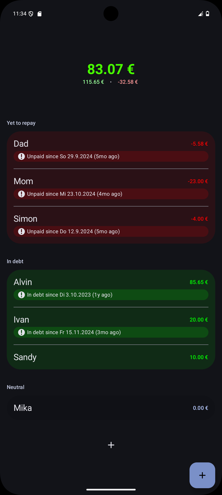
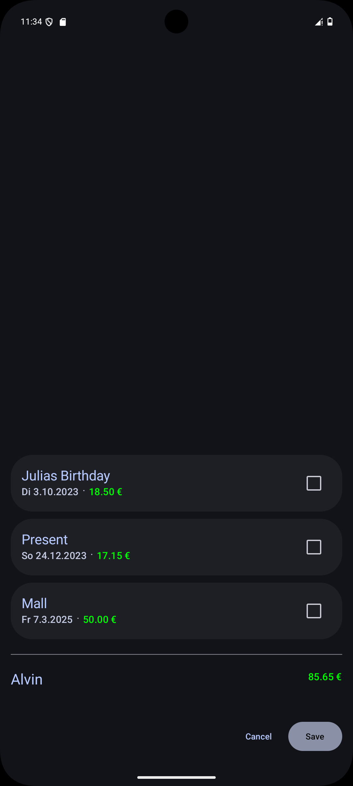

# Myxor

A simple way to track money between friends and family.

## Screenshots

    
    

## Motivation

The main motivation for this app is a personal one, just wanting a simple way to track money between
friends and family.

## Contributing

Contributing is wanted and the easiest way to do so is with an issue.

## Using the app or parts of the app

The app is intentionally published with the MIT License. Use parts of the code in your own projects
or forks, just include the notice.

# Privacy

All of the apps data is stored locally on your device, the app doesn't even have the permission for Internet.